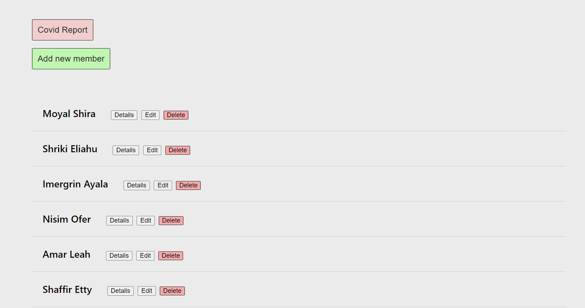
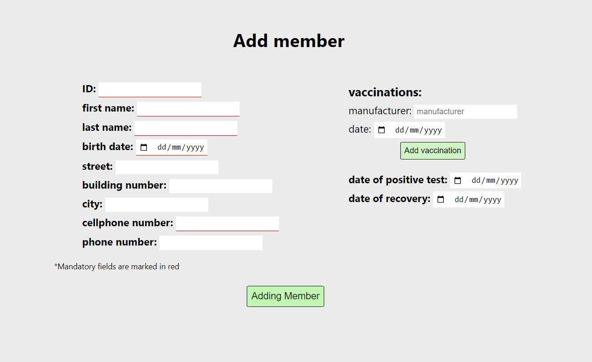
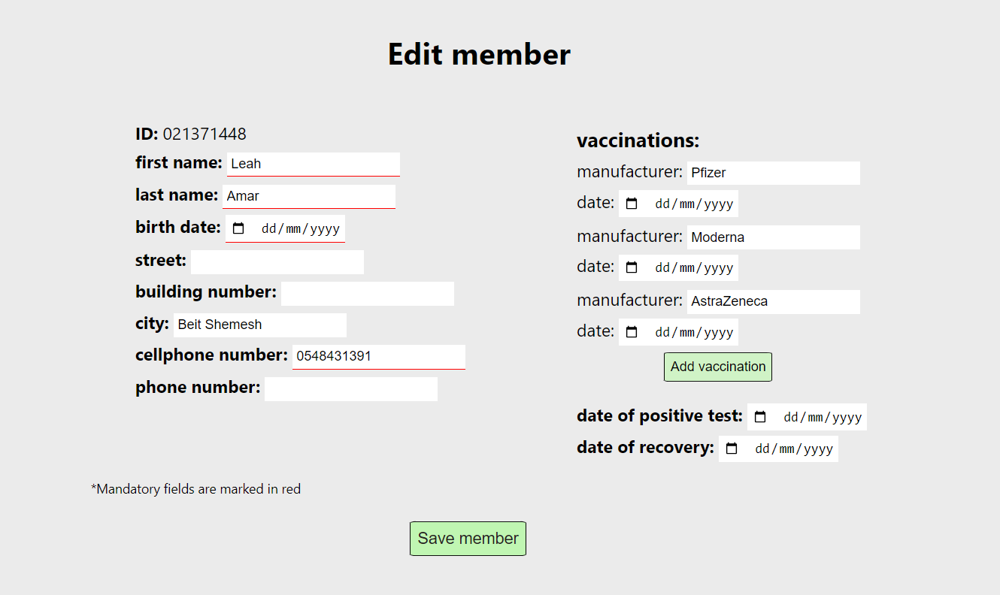
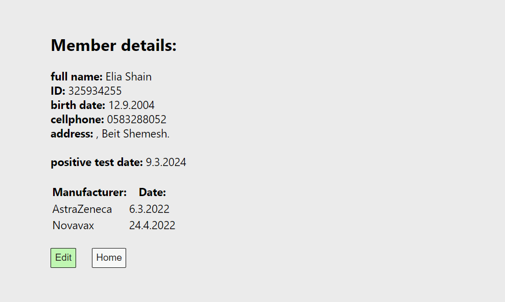
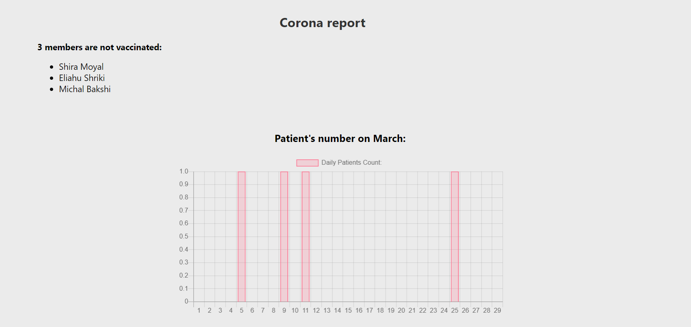

## Full Stack Project: Member Management System

This project uses Node.js, React, MongoDB, and Redux to manage member information. It provides functionalities for:
- Retrieving all members
- Adding new members
- Updating member details
- Deleting members
- And more..

**The project includes architectural specifications of the system and reporting data on corona patients.**

### Prerequisites

- MongoDB (version 5.0.3)
- Node.js (version 20.11.1) with npm
- React development environment (create-react-app recommended)

## Installation

**Cloning the project to your local device:**

In the terminal-
```
   git clone https://github.com/Tamar-Amar/Hadasim-exercise.git
```

**Backend:**
Make sure you have a compatible database system (MongoDB), Node.js Server and React installed and running.

Installations for backend:  
In the terminal- 
```
   cd Hadasim-exercise\fullstack-project-hadasim\server
   npm i
```

**Frontend:**

Installations for Frontend:   
In another terminal-
```
   cd Hadasim-exercise\fullstack-project-hadasim\client
   npm i
```


Database Setup:  
Update the database configuration in app.js to connect to your MongoDB database using the environment variables defined in the .env file.

### Running the Application:
**Backend:**  
Terminal-  
`npm run dev`

**Frontend:**  
Terminal-  
`npm start`

This will start the backend server and the React development server, allowing you to access the application in your browser (usually at http://localhost:3000).

| Method | URL Address | Description |
|---|---|---|
| GET | /api/members/getAllMembers | Retrieves information for all members|
| GET | /api/members/getMemberById/:id | Retrieves information for a specific member by their ID |
| POST | /api/members/addMember | Adds a new member to the system |
| PUT | /api/members/editMember | Update an exist member in the system |
| DELETE | /api/members/deleteMemberById/:id | Delete an exist member from the system |


#### You can use API calls in POSTMAN to make sure that all good. 

### Attached print screen From Client:
#### Home page- 

#### Add member page- 

#### Edit member page- 

#### Member's Details page- 

#### Covid reports page- 



## Thank you and good luck 🙂
